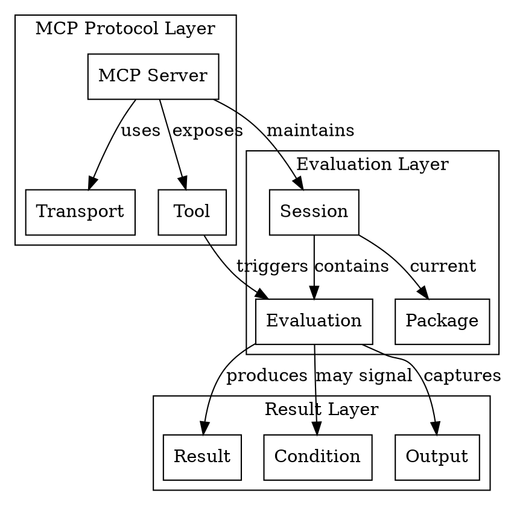
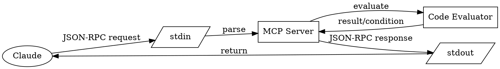

# Domain Ontology

Entity relationships in the CL-MCP-Server domain.

---

## Entity Relationship Overview

## Communication Flow

## Cardinality Summary

| Entity A | Relationship | Entity B | Cardinality |
|----------|--------------|----------|-------------|
| MCP Server | maintains | Session | 1:1 |
| MCP Server | uses | Transport | 1:1 |
| MCP Server | exposes | Tool | 1:N |
| Session | contains | Evaluation | 1:N |
| Session | has current | Package | 1:1 |
| Evaluation | produces | Result | 1:1 |
| Evaluation | may signal | Condition | 1:0..N |
| Evaluation | captures | Output | 1:1 |
