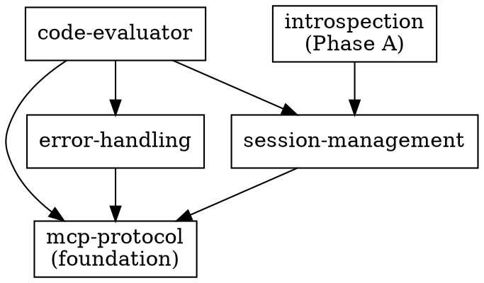

# Features Index

**All features in the CL-MCP-Server Canon.**

## Overview

| Feature | Status | Priority | Description |
|---------|--------|----------|-------------|
| [mcp-protocol](#mcp-protocol) | draft | P0 | JSON-RPC 2.0 communication over stdio |
| [code-evaluator](#code-evaluator) | draft | P0 | Common Lisp expression evaluation with safety controls |
| [session-management](#session-management) | draft | P0 | Persistent REPL environment with state tracking |
| [error-handling](#error-handling) | draft | P0 | Condition capture and structured error reporting |
| [introspection](#introspection) | draft | P1 | Phase A core introspection tools for SBCL image inspection |

## Feature Details

### mcp-protocol

**Purpose**: Implement the Model Context Protocol for communication with Claude.

**Location**: `mcp-protocol/`

**Status**: draft

**Quick Navigation**:

| Need to... | Read |
|------------|------|
| Implement initialization handshake | `contracts/initialization.md` |
| List available tools | `contracts/tools-list.md` |
| Handle tool call requests | `contracts/tools-call.md` |
| Understand stdio transport | `contracts/transport.md` |
| Test initialization flow | `scenarios/initialization-handshake.md` |
| Handle malformed requests | `scenarios/malformed-request.md` |

**Contracts**: 4
- `initialization.md` - MCP handshake
- `tools-list.md` - Tool enumeration
- `tools-call.md` - Tool invocation
- `transport.md` - stdio communication

**Scenarios**: 2
- `initialization-handshake.md` - Startup protocol
- `malformed-request.md` - Error handling

**Dependencies**: None (foundation layer)

---

### code-evaluator

**Purpose**: Execute Common Lisp code safely in a persistent session.

**Location**: `code-evaluator/`

**Status**: draft

**Quick Navigation**:

| Need to... | Read |
|------------|------|
| Implement evaluate-lisp tool | `contracts/evaluate-lisp-tool.md` |
| Test basic expressions | `scenarios/basic-evaluation.md` |
| Handle function/variable definitions | `scenarios/definitions.md` |
| Capture stdout/stderr output | `scenarios/output-capture.md` |

**Contracts**: 1
- `evaluate-lisp-tool.md` - Primary evaluation tool

**Scenarios**: 3
- `basic-evaluation.md` - Simple expressions
- `definitions.md` - Persistent definitions
- `output-capture.md` - Stream handling

**Dependencies**:
- `mcp-protocol` (for tool interface)
- `session-management` (for state)
- `error-handling` (for conditions)

---

### session-management

**Purpose**: Maintain persistent REPL state across evaluations.

**Location**: `session-management/`

**Status**: draft

**Quick Navigation**:

| Need to... | Read |
|------------|------|
| Understand session state model | `contracts/session-state.md` |
| Test state persistence | `scenarios/state-persistence.md` |
| Implement session reset | `scenarios/session-reset.md` |

**Contracts**: 1
- `session-state.md` - State management

**Scenarios**: 2
- `state-persistence.md` - Definitions persist
- `session-reset.md` - Clean slate

**Dependencies**:
- `mcp-protocol` (communication layer)

---

### error-handling

**Purpose**: Capture Lisp conditions and report them to Claude.

**Location**: `error-handling/`

**Status**: draft

**Quick Navigation**:

| Need to... | Read |
|------------|------|
| Format condition reports | `contracts/condition-report.md` |
| Test error scenarios | `scenarios/evaluation-errors.md` |

**Contracts**: 1
- `condition-report.md` - Error formatting

**Scenarios**: 1
- `evaluation-errors.md` - Error cases

**Dependencies**:
- `mcp-protocol` (response format)

---

### introspection

**Purpose**: Phase A core introspection tools for SBCL image inspection.

**Location**: `introspection/`

**Status**: draft

**Quick Navigation**:

| Need to... | Read |
|------------|------|
| Query symbol information | `contracts/describe-symbol-tool.md` |
| Search for symbols | `contracts/apropos-search-tool.md` |
| Find function callers | `contracts/who-calls-tool.md` |
| Find variable references | `contracts/who-references-tool.md` |
| Expand macro forms | `contracts/macroexpand-form-tool.md` |
| Test symbol inspection | `scenarios/symbol-inspection.md` |
| Test symbol discovery | `scenarios/symbol-discovery.md` |
| Test cross-references | `scenarios/cross-reference.md` |
| Test macro expansion | `scenarios/macro-understanding.md` |

**Contracts**: 5
- `describe-symbol-tool.md` - Symbol information
- `apropos-search-tool.md` - Symbol search
- `who-calls-tool.md` - Caller discovery
- `who-references-tool.md` - Reference discovery
- `macroexpand-form-tool.md` - Macro expansion

**Scenarios**: 4
- `symbol-inspection.md` - Querying symbols
- `symbol-discovery.md` - Finding symbols
- `cross-reference.md` - Code navigation
- `macro-understanding.md` - Macro transformations

**Dependencies**:
- `session-management` (for package context)

**Note**: SBCL-specific (uses sb-introspect)

---

## Dependency Graph

**Implementation Order** (based on dependencies):
1. `mcp-protocol` (no dependencies)
2. `session-management` (depends on mcp-protocol)
3. `error-handling` (depends on mcp-protocol)
4. `code-evaluator` (depends on all three)
5. `introspection` (depends on session-management)

## Feature Statistics

| Metric | Count |
|--------|-------|
| Total features | 5 |
| Total contracts | 12 |
| Total scenarios | 12 |
| Total properties | 0 (defined in contracts) |
| Total decisions | 0 (no decision logs yet) |

## Cross-Feature Concepts

### Common Types

Shared type definitions in `core/contracts/shared-types.md`:
- JSON-RPC message format
- Tool definition structure
- Response envelope

### Shared Vocabulary

Terms used across features (see `core/foundation/vocabulary.md`):
- **Session**: Persistent evaluation context
- **Evaluation**: Single code execution
- **Condition**: Error/warning representation
- **Transport**: Communication channel

---

**Last Updated**: 2026-01-26
