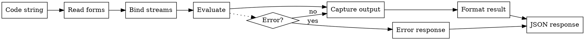

# Code Evaluator Feature Index

**Purpose**: Common Lisp expression evaluation with safety controls.

**Status**: draft
**Priority**: P0 (core functionality)

## Quick Navigation

| Need to... | Read |
|------------|------|
| Implement evaluate-lisp tool | `contracts/evaluate-lisp-tool.md` |
| Test basic expressions | `scenarios/basic-evaluation.md` |
| Handle persistent definitions | `scenarios/definitions.md` |
| Capture stdout/stderr output | `scenarios/output-capture.md` |
| Understand evaluation safety | `vocabulary.md` |

## Contents

### Contracts (4)

| File | Purpose | Phase | Key Points |
|------|---------|-------|------------|
| `contracts/evaluate-lisp-tool.md` | Primary evaluation tool | Core | Input schema, output format, stream capture, timing |
| `contracts/configure-limits-tool.md` | Safety configuration | 0 | Timeout and output limits |
| `contracts/compile-form-tool.md` | Code compilation | B | Type checking, warnings without execution |
| `contracts/time-execution-tool.md` | Performance profiling | B | Timing, memory allocation, GC metrics |

### Scenarios (3)

| File | Purpose | Test Cases |
|------|---------|------------|
| `scenarios/basic-evaluation.md` | Simple expressions | 6 cases: arithmetic, strings, lists, multiple values, NIL, multiple forms |
| `scenarios/definitions.md` | Persistent state | Function/variable definitions across evaluations |
| `scenarios/output-capture.md` | Stream handling | stdout, stderr, warnings separation |

### Vocabulary (1)

`vocabulary.md` - Evaluation-specific terms:
- **Code**: Lisp expression(s) to evaluate
- **Result**: Return value(s) from evaluation
- **Output**: Captured stdout/stderr during evaluation
- **Stream Capture**: Redirecting standard streams

## Tool Definition

### evaluate-lisp

**The primary MCP tool** for executing Common Lisp code.

**Input Schema**:
```json
{
  "type": "object",
  "required": ["code"],
  "properties": {
    "code": {
      "type": "string",
      "description": "Lisp expression(s) to evaluate"
    },
    "package": {
      "type": "string",
      "description": "Package context (optional, defaults to session package)"
    }
  }
}
```

**Output Format**:

```
[stdout]
{captured standard output}

[stderr]
{captured error output}

[warnings]
STYLE-WARNING: {warning message}

=> {return value 1}
=> {return value 2}
...
```

**Sections are omitted if empty.**

## Evaluation Pipeline



## Stream Capture

### Captured Streams

During evaluation, these streams are redirected:

| Stream | Captured To | Section | Purpose |
|--------|-------------|---------|---------|
| `*standard-output*` | String stream | `[stdout]` | Normal output |
| `*error-output*` | String stream | `[stderr]` | Error messages |
| `*trace-output*` | String stream | `[stderr]` | Debug traces |
| `*debug-io*` | Null stream | (suppressed) | No interactive I/O |
| `*query-io*` | Null stream | (suppressed) | No interactive I/O |

**Rationale**: Interactive I/O is impossible through MCP, so suppress it.

### Print Control

Return values are printed with:

| Variable | Value | Purpose |
|----------|-------|---------|
| `*print-length*` | 100 | Truncate long lists |
| `*print-level*` | 10 | Truncate deep nesting |
| `*print-circle*` | t | Handle circular structures |
| `*print-pretty*` | t | Readable formatting |

## Condition Handling

### Warnings

Warnings are **captured but don't stop evaluation**:

```lisp
(handler-bind ((warning (lambda (c)
                          (record-warning c)
                          (muffle-warning c))))
  (eval form))
```

Warnings appear in the `[warnings]` section.

### Errors

Errors are **caught and reported**:

```lisp
(handler-case (eval form)
  (error (c)
    (make-error-response c)))
```

Error response format:

```
[ERROR] {CONDITION-TYPE}
{condition message}

[Backtrace]
{formatted backtrace}
```

### Condition Types

| Condition | Handling |
|-----------|----------|
| `warning` | Record and muffle |
| `style-warning` | Record and muffle |
| `error` | Catch, format, return as error |
| `serious-condition` | Catch, format, return as error |
| `storage-condition` | Catch, format, return as error |

## Safety Considerations

### Current Approach

- Catch all conditions to prevent server crash (INV-002)
- Redirect interactive I/O to null (no `read` from user)
- Limit print depth/length to avoid resource exhaustion

### Future Enhancements

Consider (not yet implemented):

- `sb-ext:restrict-compiler-policy` for SBCL
- Time limits on evaluation
- Memory limits
- Restricted package (disallow certain symbols)

## Example Scenarios

### Basic Arithmetic

**Input**:
```json
{
  "code": "(+ 1 2 3)"
}
```

**Output**:
```
=> 6
```

### With Output

**Input**:
```json
{
  "code": "(progn (print 'hello) (+ 1 2))"
}
```

**Output**:
```
[stdout]
HELLO

=> 3
```

### With Error

**Input**:
```json
{
  "code": "(/ 1 0)"
}
```

**Output**:
```
[ERROR] DIVISION-BY-ZERO
arithmetic error DIVISION-BY-ZERO signalled

[Backtrace]
0: (/ 1 0)
```

### Persistent Definitions

**Request 1**:
```json
{"code": "(defun square (x) (* x x))"}
```

**Response 1**:
```
=> SQUARE
```

**Request 2** (later in same session):
```json
{"code": "(square 5)"}
```

**Response 2**:
```
=> 25
```

Function definition persists (INV-003).

## Dependencies

**Depends on**:
- `mcp-protocol` (tool interface, response format)
- `session-management` (persistent state)
- `error-handling` (condition formatting)
- `core/foundation/vocabulary.md` (Evaluation, Session, Condition)
- `core/foundation/invariants.md` (INV-002: stability, INV-003: persistence, INV-004: output separation)

**Depended on by**: None (this is the end-user feature)

## Verification

From `verification/` directory:
- Basic expression tests
- Output capture tests
- Error handling tests
- State persistence tests

## Common Issues

### Issue: Output missing

**Symptom**: `print` statements don't appear in response.

**Cause**: Not capturing `*standard-output*`.

**Solution**: Bind `*standard-output*` to string stream during evaluation.

### Issue: Circular structure hangs

**Symptom**: Server freezes when printing circular lists.

**Cause**: `*print-circle*` is nil.

**Solution**: Set `*print-circle*` to `t` before printing.

### Issue: Definitions don't persist

**Symptom**: Functions defined in one request are undefined in next.

**Cause**: Evaluating in ephemeral package or environment.

**Solution**: Maintain persistent `*package*` across evaluations (see session-management).

### Issue: Server crashes on error

**Symptom**: Server terminates when code signals error.

**Cause**: Not catching conditions (violates INV-002).

**Solution**: Wrap evaluation in `handler-case`.

---

**Last Updated**: 2026-01-22
**Status**: draft
**Next Steps**: Add property specifications for evaluation safety
