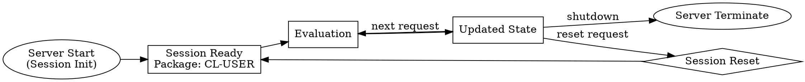

# Session Management Feature Index

**Purpose**: Persistent REPL environment with state tracking.

**Status**: draft
**Priority**: P0 (required for REPL experience)

## Quick Navigation

| Need to... | Read |
|------------|------|
| Understand session state model | `contracts/session-state.md` |
| Test state persistence | `scenarios/state-persistence.md` |
| Implement session reset | `scenarios/session-reset.md` |
| Learn session lifecycle | `vocabulary.md` |

## Contents

### Contracts (1)

| File | Purpose | Lines | Key Points |
|------|---------|-------|------------|
| `contracts/session-state.md` | State management model | TBD | Package context, symbol table, loaded systems |

### Scenarios (2)

| File | Purpose | Test Cases |
|------|---------|------------|
| `scenarios/state-persistence.md` | Definitions persist | Functions, variables, classes persist across evaluations |
| `scenarios/session-reset.md` | Clean slate | Reset session to initial state |

### Vocabulary (1)

`vocabulary.md` - Session-specific terms:
- **Session State**: Current package, defined symbols, loaded systems
- **Package Context**: Current `*package*` binding
- **Symbol Table**: All interned symbols in session packages
- **Session Reset**: Returning to clean initial state

## Session Model

### What Persists

The session maintains state across evaluations:

| State Component | Persists? | Example |
|----------------|-----------|---------|
| Function definitions | ✓ | `defun`, `defmethod` |
| Variable bindings | ✓ | `defvar`, `defparameter`, `setf` |
| Class definitions | ✓ | `defclass`, `defstruct` |
| Package context | ✓ | `in-package`, `*package*` binding |
| Loaded systems | ✓ | `(ql:quickload ...)` |
| Local bindings | ✗ | `let`, `flet` (scope-limited) |
| Dynamic bindings | ✗ | `let ((*var* ...))` (evaluation-local) |

### Lifecycle



## Implementation Requirements

### Session Initialization

On server start:

```lisp
(defvar *session-package* (find-package :cl-user))
```

**Default package**: `CL-USER` (or create custom package)

### Evaluation Context

Each evaluation runs in the session context:

```lisp
(defun evaluate (code)
  (let ((*package* *session-package*))
    (eval (read-from-string code))))
```

**Critical**: Use same `*package*` instance across evaluations (INV-003).

### Package Switching

Support in-band package switching:

```lisp
;; User code
(in-package :my-package)

;; Server updates session state
(setf *session-package* (find-package :my-package))
```

**Alternative**: Support `package` parameter in evaluate-lisp tool:

```json
{
  "code": "(defun foo () ...)",
  "package": "MY-PACKAGE"
}
```

## Example Scenario: State Persistence

### Evaluation 1: Define Function

**Request**:
```json
{
  "code": "(defun factorial (n) (if (<= n 1) 1 (* n (factorial (1- n)))))"
}
```

**Response**:
```
=> FACTORIAL
```

**Session State After**:
- Symbol `FACTORIAL` interned in `CL-USER`
- Function definition stored

### Evaluation 2: Use Function

**Request** (later, same session):
```json
{
  "code": "(factorial 5)"
}
```

**Response**:
```
=> 120
```

**Key**: Function definition persisted from Evaluation 1.

### Evaluation 3: Redefine

**Request**:
```json
{
  "code": "(defun factorial (n) (if (<= n 1) 1 (* n (factorial (- n 1)))))"
}
```

**Response**:
```
=> FACTORIAL
```

**Session State After**:
- Function `FACTORIAL` is **updated** (not duplicated)

## Example Scenario: Session Reset

### Before Reset

```lisp
CL-USER> (defvar *counter* 0)
*COUNTER*

CL-USER> (incf *counter*)
1
```

### Reset Request

**Method**: TBD (could be special tool, could be code like `(reset-session)`)

### After Reset

```lisp
CL-USER> *counter*
;; ERROR: The variable *COUNTER* is unbound
```

**State cleared**:
- All user-defined functions removed
- All user-defined variables removed
- Package context reset to CL-USER
- Loaded systems remain (can't unload)

## Dependencies

**Depends on**:
- `mcp-protocol` (communication layer)
- `core/foundation/vocabulary.md` (Session, Package)
- `core/foundation/invariants.md` (INV-003: state persistence)

**Depended on by**:
- `code-evaluator` (uses session state for evaluations)

## Verification

From `verification/` directory:
- State persistence tests (definitions across requests)
- Package switching tests
- Session reset tests

## Common Issues

### Issue: Definitions lost between evaluations

**Symptom**: Function defined in one request is undefined in next.

**Cause**: Creating new package or environment for each evaluation.

**Solution**: Reuse same `*package*` binding across evaluations.

### Issue: Package switching doesn't work

**Symptom**: `(in-package :foo)` has no effect on next evaluation.

**Cause**: Not tracking `*package*` changes after evaluation.

**Solution**: Capture `*package*` value after eval, store in session state.

### Issue: Can't reset session

**Symptom**: No way to clear state.

**Solution**: Implement session reset mechanism (tool or special form).

## Design Decisions

### Decision: Single Session vs. Multiple Sessions

**Choice**: Single session per server instance (1:1 cardinality).

**Rationale**:
- Simpler implementation
- MCP doesn't have multi-session concept
- Matches typical REPL experience

**Alternative**: Could support multiple named sessions if needed in future.

### Decision: Default Package

**Choice**: Start in `CL-USER` package.

**Rationale**:
- Standard REPL default
- Familiar to all Lisp users
- Has imports from `COMMON-LISP` package

**Alternative**: Could create custom package (e.g., `MCP-USER`) with controlled imports.

### Decision: Loaded Systems Persist

**Choice**: Systems loaded via `ql:quickload` remain loaded after reset.

**Rationale**:
- Can't reliably unload systems in Lisp
- Re-loading is expensive
- Systems are typically "infrastructure" not "user code"

**Trade-off**: Reset is not a true "clean slate".

---

**Last Updated**: 2026-01-22
**Status**: draft
**Next Steps**: Implement session-state contract, add reset mechanism
